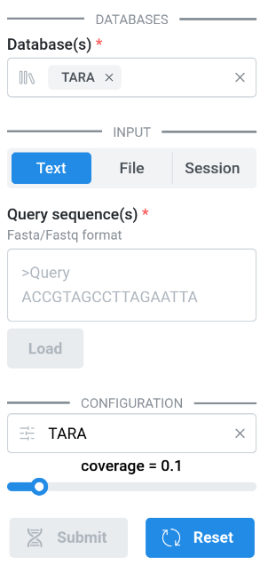
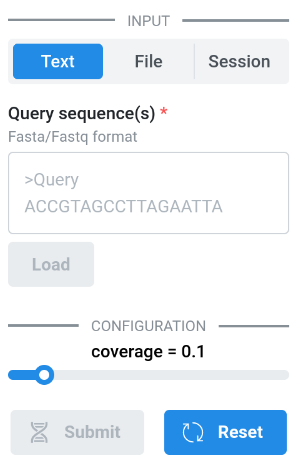

# Configuration

**kmviz** can be configured using a [`yaml`](https://yaml.org/) or [`toml`](https://toml.io/en/) configuration file. The documentation contains examples for both formats.

The **kmviz** configuration is divided into 2 main sections: `databases` and `cache` described separately here for clarity. In practice the configuration is stored in a single `yaml`/`toml` file.

The following sections are optional:

- [`auth`](#authentication-section): Basic authentication
- [`input`](#input-section): Define input constraints, *e.g.* max query size.
- [`defaults`](#defaults-section): Select the default database(s)

An optional section can also be used to describe visualization presets, see [Presets](#presets-section).

## Databases section

<div class="grid cards" markdown>

```yaml title="config.yaml (databases section)"
databases:
  - ExampleDB:
      type: "kmindex-server"
      params:
        url: "127.0.0.1"
        port: 8080
      metadata:
        type: "tsv"
        params:
          path: "./metadata.tsv"
          sep: "\t"
          idx: "Sample"
          geodata:
            latitude: "Lat"
            longitude: "Long"
```

```toml title="config.toml (databases section)"
[databases]

[databases.ExampleDB]
type = "kmindex-server"
[databases.ExampleDB.params]
url = "127.0.0.1"
port = 8080

[databases.ExampleDB.metadata]
type = "tsv"
[databases.ExampleDB.metadata.params]
path = "./metadata.tsv"
sep = "\t"
idx = "Sample"
geodata = { latitude = "Lat", longitude = "Long"}
```

</div>

## Cache section

For local instances, cache configuration is not a critical point. The example below will work in many cases.

:warning: For multi-user instances, a particular attention is recommended, see [Deployment](../deploy/docker.md#about-cache).

<div class="grid cards" markdown>

```yaml title="config.yaml (cache section)"
cache:
  manager:
    type: "disk"
    params:
      directory: ".results/kmviz_manager_cache"

  result:
    type: "disk"
    params:
      cache_dir: ".results/kmviz_result_cache"
      threshold: 0
      default_timeout: 1209600

  serverside:
    type: "disk"
    params:
      cache_dir: ".results/kmviz_serverside_cache"
      threshold: 0
      default_timeout: 86400
```

```toml title="config.toml (cache section)"
[cache]

[cache.serverside]
type = "disk"
params.cache_dir = ".results/kmviz_serverside_cache"
params.threshold = 0
params.default_timeout = 86400

[cache.manager]
type = "disk"
params.directory = ".results/kmviz_manager_cache"

[cache.result]
type = "disk"
params.cache_dir = ".results/kmviz_result_cache"
params.threshold = 0
params.default_timeout = 1209600
```

</div>

## Authentication section

At the moment, **kmviz** has limited authentication support with only [HTTP BasicAuth](https://datatracker.ietf.org/doc/html/rfc7617). Crendentials can be specified directly in the configuration file, or retrieved through the system keyring service. See [jaraco/keyring](https://github.com/jaraco/keyring) for the list of supported keyring backends.

Note that authentication section is optional.


<div class="grid" markdown>

```yaml title="config.yaml (Inline)"
auth:
  username: "password"
  username_2: "password_2"
```
```yaml title="config.yaml (Keyring)"
auth:
  - username
  - username_2
```

```toml title="config.toml (Inline)"
[auth]
username = "password"
username_2 = "password_2
```
```toml title="config.toml (Keyring)"
auth = ["username", "username_2"]
```

</div>

## Input section

The `input` section allows to define input constraints:

- `max_query`: Maximum number of queries
- `max_query_size`: Maximum number of characters per query
- `max_size`: Maximum number of characters (total)
- `alphabet`: Restrict input to `dna` or `amino` sequences

<div class="grid" markdown>

```yaml title="config.yaml (input section)"
input:
  max_query: 10
  max_query_size: 300
  max_size: 50000
  alphabet: "dna"
```

```toml title="config.toml (input section)"
[input]
max_query = 10
max_query_size = 300
max_size = 50000
alphabet = "dna"
```

</div>

## Defaults section

The `defaults` section allows to select default database(s):

- `databases`: The list of databases that will be preselected in [Input database(s)](../interface/database.md#select-databases).
- `configuration`: The database that will be preselected in [Input configuration](../interface/database.md#select-databases).
- `hide_db`: Can be used to hide the [database and configuration selectors](../interface/database.md#select-databases) when a single default database is set, allowing to streamline the user interface.

<div class="grid" markdown>

```yaml title="config.yaml (defaults section)"
defaults:
  databases:
    - ExampleDB
  configuration: ExampleDB
  hide_db: true
```

```toml title="config.toml (defaults section)"
[defaults]
databases = ["ExampleDB"]
configuration = "ExampleDB"
hide_db = true
```

</div>

<div class="grid cards" markdown>





</div>

## Presets section

:construction: