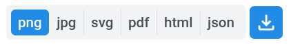
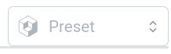

# Figure

Maps and plots are produced using [plotly](https://plotly.com/python/) and **kmviz** follows the naming of plot properties. This means that you can read the plotly documentation to learn more about each available properties. The documentation links for each map and plot types supported by **kmviz** are provided in corresponding pages: [Map](../map.md) and [Plot](../plot.md).

!!! Tip "Important"

    When making figures, **kmviz** distinguishes 2 types of action: those that **create a new figure** (the `Trace` tab for both maps and plots), *e.g.* change the plot type, and those that **update the figure**, *e.g.* change the title. When enabled auto updates are enabled, all properties corresponding to **update actions** are automatically re-applied when the figure is modified. For example, if you set a title, then change the plot type, the title remains. See [auto update switch](../nav.md#buttons).

!!! Tip ""
    A good way to learn how to use the plotting interface is probably to play with arbitrary data and the **kmviz** [`plot mode`](../../plot.md).

---

Some features are common to plots and maps and are presented below.

## Download

Figure can be downloaded in various format using the following selector.

!!! Note
    - `JSON`: Dump the figure in the `plotly JSON` format.

## Filters

As for the `Table` tab, filtering using SQL `WHERE` clause is supported. See [Table](../table.md) for more details.

## Presets

When running a **kmviz** instance, one can decide to provide some figure presets to propose default visualizations to users. You can select one preset using the selector presented below.

See also [presets configuration]().
